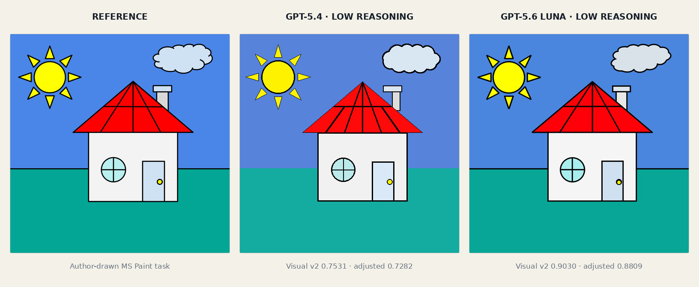
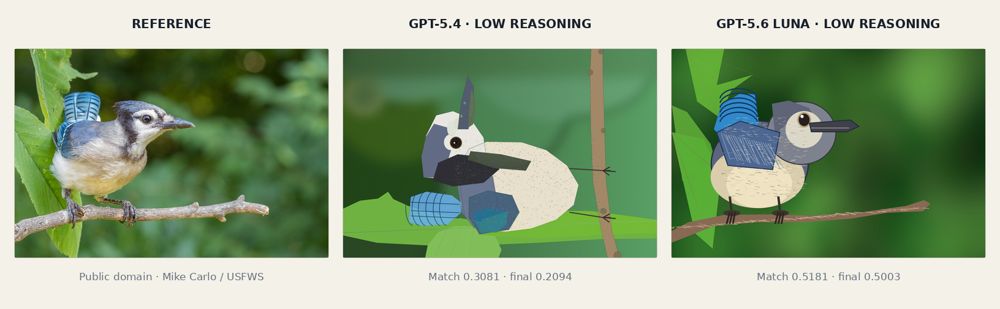
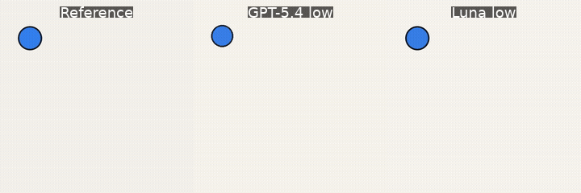

# MimesisGym

**Can an AI rebuild what it sees—not just describe it?**

MimesisGym is a benchmark for multimodal agents that reconstruct visual references with code. The model sees an image, works inside an isolated sandbox, and submits its own rendering. The result is measured against the original for literal spatial accuracy.

An easy geometric task. GPT-5.4 matched 0.7531; GPT-5.6 Luna matched 0.9030.

A difficult natural image at its native 2971×1981 resolution. GPT-5.4 matched 0.3081; GPT-5.6 Luna matched 0.5181.

A sparse-frame motion task. GPT-5.4 matched 0.9273 on hidden frames; GPT-5.6 Luna matched 0.9517.

Recognizing the subject is easy. Reconstructing its exact geometry, position, color, texture, and layer order is not. MimesisGym makes that gap visible—and measurable.

## How it works

1. **Observe** — the agent receives an image or sparse timestamped video frames.
2. **Reconstruct** — it writes and runs rendering code in a fresh, isolated workspace.
3. **Measure** — the submission is scored for local appearance, spatial geometry, and hidden motion.

Every task starts with a new model context and sandbox. The reference itself never enters the agent's filesystem.

## Tracks

| Track | Challenge | Status |
| --- | --- | --- |
| [Image](docs/tracks/image/README.md) | Reconstruct one image at its native resolution. | **Image v0.1 available** |
| [Video](docs/tracks/video/README.md) | Reconstruct a complete animation from five sparse frames. | **Video v0.1 available** |
| [3D](docs/tracks/3d/README.md) | Build a 3D asset from several rendered viewpoints. | Planned |

The tracks share one idea: test whether an agent can decompose visual structure and rebuild it precisely, not merely name what it sees.

## Start exploring

- [Install and run MimesisGym](docs/installation.md)
- [Learn about the Image benchmark](docs/tracks/image/README.md)
- [Learn about the Video benchmark](docs/tracks/video/README.md)
- [Understand the architecture and isolation model](docs/architecture.md)

MimesisGym is an early evaluation environment, not yet an RL training framework. Code is licensed under [Apache-2.0](LICENSE); the bundled procedural sample set is CC0-1.0.
