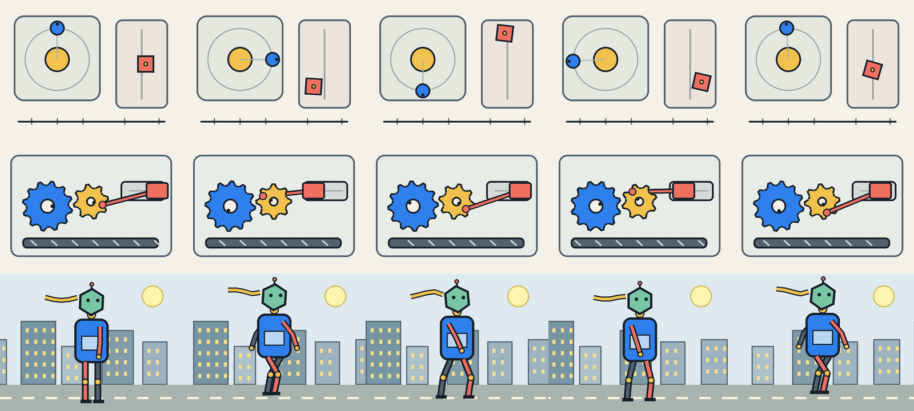

# Video v0.2 candidate set

These three deterministic CC0 clips are calibration candidates, not part of the frozen Video v0.1 benchmark. Each clip is 320×240, 30 fps, 120 frames, and exactly four seconds long. Five observations are sampled at frames 0, 30, 60, 89, and 119.



- **Easy — Dual motion:** an orbiting body and an independently oscillating, rotating slider.
- **Medium — Geared piston:** meshed gears drive a crank and piston while a conveyor moves below; rod depth changes with crank phase.
- **Hard — Walking robot:** a multi-joint gait, phase-dependent limb ordering, a waving scarf, and parallax-like background scrolling.

The intended difficulty labels are hypotheses. Promote or relabel tasks only after running the same model panel and confirming useful score separation. Regenerate the complete set with:

```bash
python scripts/generate_video_candidates_v2.py --output benchmarks/video/candidates/v0.2
```

Run an individual candidate through the existing harness without changing the frozen v0.1 sample manifest:

```bash
mimesisgym video eval \
  --reference benchmarks/video/candidates/v0.2/dual-motion.mp4 \
  --label "Dual motion" \
  --model gpt-5.6-luna \
  --reasoning low
```
