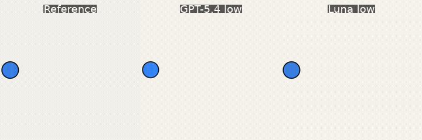
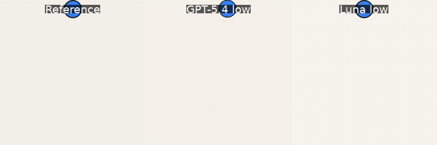

# Video track

**Status: Video v0.1 is implemented.**

The Video track asks a multimodal agent to reconstruct a short animation from five timestamped frames. The model must infer what happens between those observations, render the complete sequence with code, and submit a standards-compliant video. This separates recognizing motion from recovering its exact path, speed, collisions, and timing.

## Baseline snapshot

### Elastic wall bounce


[Reference MP4](../../../benchmarks/video/samples/seed_v1/elastic-bounce.mp4) · [GPT-5.4 MP4](../../assets/video/elastic-bounce-gpt-5.4-low.mp4) · [GPT-5.6 Luna MP4](../../assets/video/elastic-bounce-luna-low.mp4)

### Constant horizontal motion



[Reference MP4](../../../benchmarks/video/samples/seed_v1/constant-horizontal.mp4) · [GPT-5.4 MP4](../../assets/video/constant-horizontal-gpt-5.4-low.mp4) · [GPT-5.6 Luna MP4](../../assets/video/constant-horizontal-luna-low.mp4)

### Gravity-accelerated fall



[Reference MP4](../../../benchmarks/video/samples/seed_v1/gravity-fall.mp4) · [GPT-5.4 MP4](../../assets/video/gravity-fall-gpt-5.4-low.mp4) · [GPT-5.6 Luna MP4](../../assets/video/gravity-fall-luna-low.mp4)

Both models used low reasoning through the OpenAI Responses API. Every published episode had a fresh context, fresh offline 2 GB container, and the same limits: 15 turns, 50 tool calls, 6,000 output tokens per turn, 30,000 total output tokens, and 20 minutes. Both models submitted all three videos.

| Task | GPT-5.4 match | GPT-5.4 final | Luna match | Luna final |
| --- | ---: | ---: | ---: | ---: |
| Elastic wall bounce | 0.9273 | 0.8971 | **0.9517** | **0.9380** |
| Constant horizontal | **0.9836** | 0.9647 | 0.9819 | **0.9717** |
| Gravity fall | 0.9164 | 0.8857 | **0.9262** | **0.9141** |
| **Mean** | 0.9425 | 0.9158 | **0.9532** | **0.9413** |

**Match** is the mean over 175 hidden frames; **final** applies the shared output-token penalty. GPT-5.4 averaged 2,331 output tokens and 8.7 turns. Luna averaged 1,598 output tokens and 3.7 turns. The difference between visible and hidden performance is deliberate: frames shown to the model never contribute to match.

During harness calibration, two earlier GPT-5.4 attempts rendered valid files but reached tighter 8- and 10-turn cutoffs while inspecting frames before submission. SymPy was also missing in the first attempt. Those calibration runs are not included above: SymPy was added, the video limit was fixed at 15 turns, and all six published episodes ran under the resulting contract. This is a small systems baseline, not a broad model ranking.

## Episode contract

Each 3-second bundled task contains 180 frames at 60 fps and 512×512 pixels. The model receives five decoded frames in chronological order:

```text
frame 0    0.0000 s
frame 45   0.7500 s
frame 90   1.5000 s
frame 134  2.2333 s
frame 179  2.9833 s
```

Every task receives a fresh model context and fresh offline Docker workspace. The reference MP4 never enters that workspace. The prompt states the exact dimensions, frame rate, frame count, timestamps, and attachment order.

The submission must be an MP4 with exactly one H.264 video stream, the requested dimensions, frame rate, and frame count, and no audio. Encoding quality settings such as CRF, preset, and H.264 profile are left to the agent.

## What the agent can use

The sandbox exposes `bash`, `write_file`, `read_file`, `read_image`, and `submit_video`. Pillow, aggdraw, NumPy, OpenCV, Matplotlib, scikit-image, SymPy, and FFmpeg with `libx264` are preinstalled. There is intentionally no special video-inspection tool. To inspect its animation, the agent must use FFmpeg to extract a chosen frame and then open that frame with `read_image`.

The container has no network access, 2 GB of RAM, and 2 CPUs. Model API calls remain on the host; only tool calls execute inside Docker.

## Hidden-frame reward

Video v0.1 scores each timestamp for localized pixel accuracy and structural similarity. The per-frame appearance score is:

```text
0.55 × localized color similarity + 0.45 × structural similarity
```

Localized color similarity emphasizes the worst quarter of a 16×16 patch grid. Structural similarity is evaluated on a 128-pixel preview for predictable scoring latency.

The official visual reward is the simple mean over the 175 hidden frames. The five observed frames are excluded. Reports show visible-frame, hidden-frame, all-frame, and worst-hidden-frame values separately so interpolation failures are easy to spot. The shared token-efficiency and non-submission penalties are then applied to produce the final reward.

## Bundled tasks

`video_seed_v1` contains three deterministic CC0 animations:

- **Elastic wall bounce** — constant velocity with perfectly elastic wall collisions.
- **Constant horizontal motion** — a ball crosses the canvas at constant speed.
- **Gravity-accelerated fall** — a ball starts from rest under constant acceleration.

The references are generated by [`scripts/generate_video_samples.py`](../../../scripts/generate_video_samples.py). Their manifest records dimensions, frame rate, frame count, and SHA-256 digests.

## Run it

```bash
mimesisgym sandbox build
mimesisgym video samples
mimesisgym video eval --sample elastic-bounce --model gpt-5.6-luna --reasoning low
mimesisgym report serve runs/suite-... --port 1638
```

You can also evaluate a local H.264 MP4 with `--reference /path/to/video.mp4`. Video v0.1 accepts up to 600 frames, 120 fps, 100 MiB, 1920×1080 pixels per frame, and 100 million decoded pixels per clip. Reference videos with audio are rejected.

## Current limitations

- The initial tasks use one rigid shape and simple analytic motion; they do not yet test deformation, occlusion, camera motion, or realistic scenes.
- Five evenly spaced observations are the default. Observation count is configurable, but adaptive sampling is not implemented.
- The appearance-based reward should be calibrated against human motion judgments before it becomes an RL objective.
- Input URLs and multi-video manifests are not implemented for Video v0.1; use local files or bundled samples.
- Docker is not microVM-grade isolation; see the [architecture guide](../../architecture.md).

Return to the [project overview](../../../README.md) or explore the [Image track](../image/README.md).
